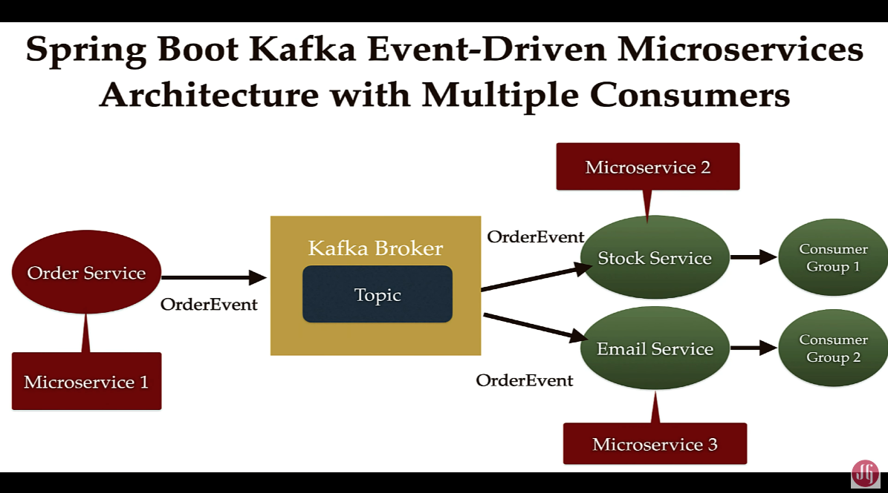

# event-driven-microservices-springboot-kafka


## How to run apache kafka server
### Step 1: Get Kafka
- follow instructions here https://kafka.apache.org/quickstart
- download https://www.apache.org/dyn/closer.cgi?path=/kafka/3.4.0/kafka_2.13-3.4.0.tgz
``` 
cd kafka_2.13-3.4.0
```
### Step 2: Start Kafka Environment
- Start the ZooKeeper service

```
$ bin/zookeeper-server-start.sh config/zookeeper.properties
```

- Start the Kafka broker service
```
$ bin/kafka-server-start.sh config/server.properties
```